# Challenge 1

## Introducción a la IA Generativa

### Creación de Contenido con ChatGPT

**Fecha de entrega:** 17 de julio del 2024

**Equipo 39:**
- Juan Manuel Escobar
- Mauricio Ortíz Estrada
- Juan Fernando
- José Puga
- Claudia Silva

---

## Introducción

### Objetivo del Proyecto

El objetivo de este proyecto es aplicar los conceptos aprendidos en el curso de IA Creativa mediante la creación de contenido web, de marketing o artículos informativos utilizando exclusivamente ChatGPT. Los estudiantes desarrollarán habilidades en *prompt engineering*, sumarización, reescritura y verificación de hechos. Este proyecto busca demostrar la versatilidad y el potencial de la IA generativa en la creación de contenido de calidad.

### Descripción General del Proyecto

En este proyecto, cada equipo trabajará colaborativamente para generar contenido específico utilizando ChatGPT. El tipo de contenido puede incluir correos electrónicos, publicaciones en redes sociales, anuncios u otros materiales de marketing. A lo largo del proyecto, los equipos deberán utilizar diversas técnicas de *prompt engineering* para guiar a ChatGPT en la generación de contenido preciso, relevante y atractivo. Además, aplicarán habilidades de sumarización para extraer información clave de fuentes externas, reescribir y adaptar el contenido generado, y verificar la precisión de los hechos para garantizar la calidad y credibilidad del resultado final.

### Importancia de la IA Generativa en la Creación de Contenido

La inteligencia artificial generativa, como ChatGPT, ha transformado la manera en que se crea contenido. Estas herramientas permiten la generación rápida y eficiente de texto, ofreciendo nuevas posibilidades para la creación de contenido personalizado y adaptado a diversas audiencias. Al utilizar IA generativa, los creadores de contenido pueden ahorrar tiempo y recursos, al mismo tiempo que mantienen un alto nivel de calidad y relevancia. Este proyecto no solo proporciona una comprensión práctica de cómo utilizar estas herramientas, sino que también destaca su potencial para innovar y optimizar la creación de contenido en diversos contextos profesionales.

---

## Exploración Previa

**Tema del Proyecto:** Campaña de marketing para lanzamiento de “Burrito Pop” en México.

**Fuente:** [burritopop.com](https://burritopop.com/)

### Draft de Contenido

Lo primero fue poner en contexto a ChatGPT utilizando la dinámica de “role play” para darle un papel: ser un equipo de marketing trabajando para un cliente que busca lanzar un producto en el mercado mexicano:

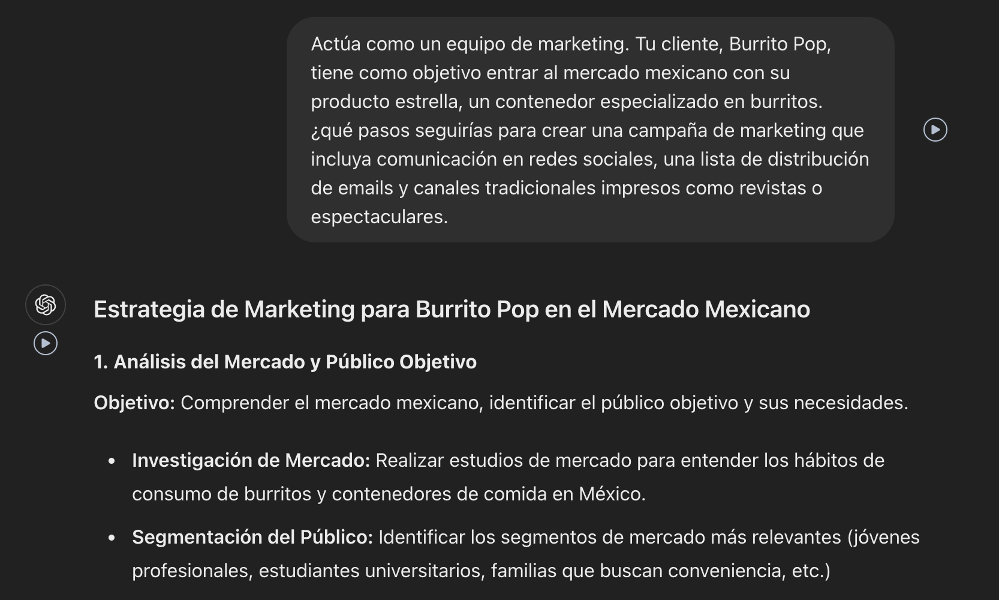

ChatGPT entregó un esquema de Estrategia de Marketing, sin embargo, era muy general para lo que buscamos. Ajustamos el prompt para darle más contexto y que su propuesta se adecuara de mejor forma a lo que buscábamos:

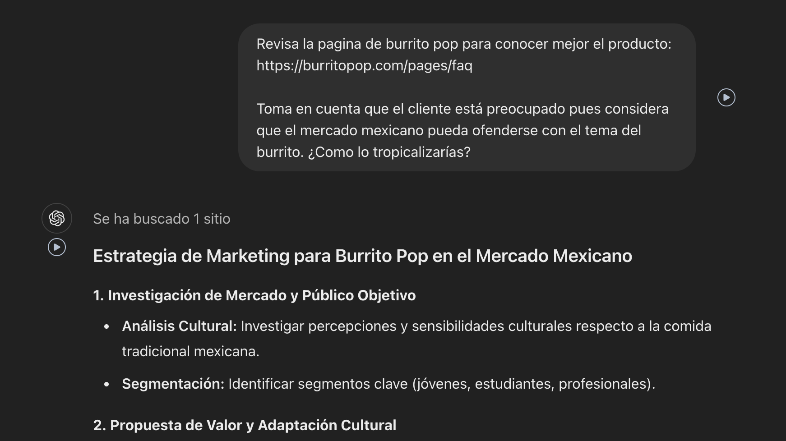

Con esto, GPT adaptó la estrategia un poco mejor, sin embargo, decidió cambiar el nombre del producto XD para “adaptarlo al mercado mexicano”.

Ahí identificamos un área de oportunidad para que, sin cambiar el nombre del producto, los casos de uso debieran adaptarse al mercado mexicano: “no comemos burritos, pero sí mucha garnacha”.

Tras tener una mejor definición del mercado meta y la tropicalización del producto al mercado, sin cambiar su nombre, solicitamos a ChatGPT crear un “concepto creativo” que sería la línea rectora para la generación de nuestros entregables:

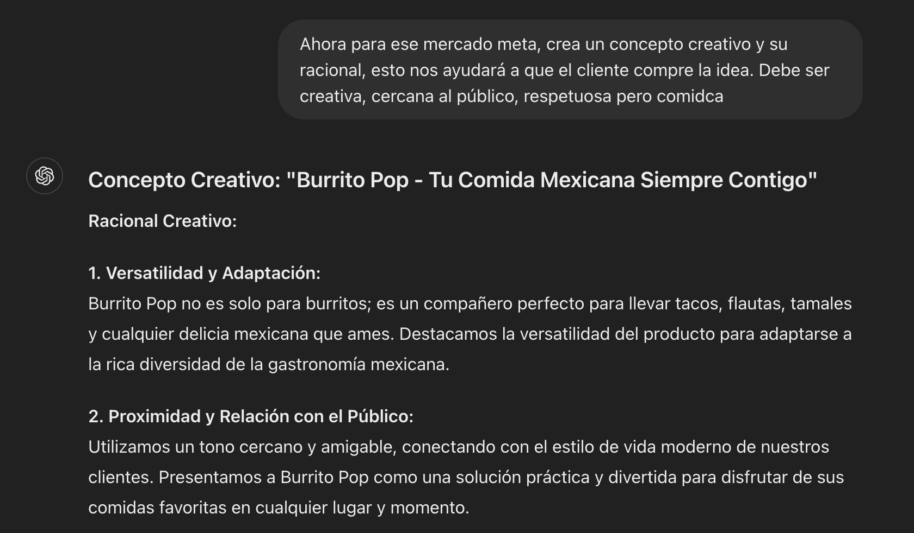

Siguiendo la lógica del “juego de rol” le fuimos dando feedback, “a nombre del cliente” para guiar a GPT hacia propuestas más creativas:

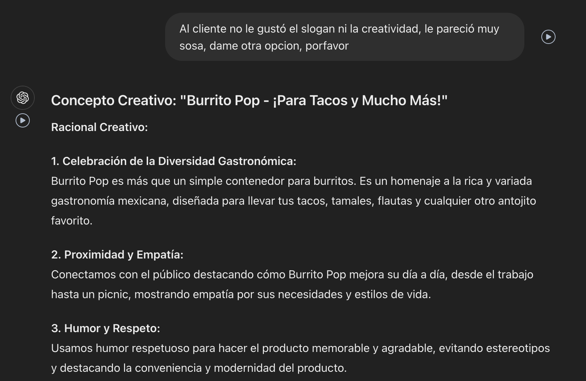
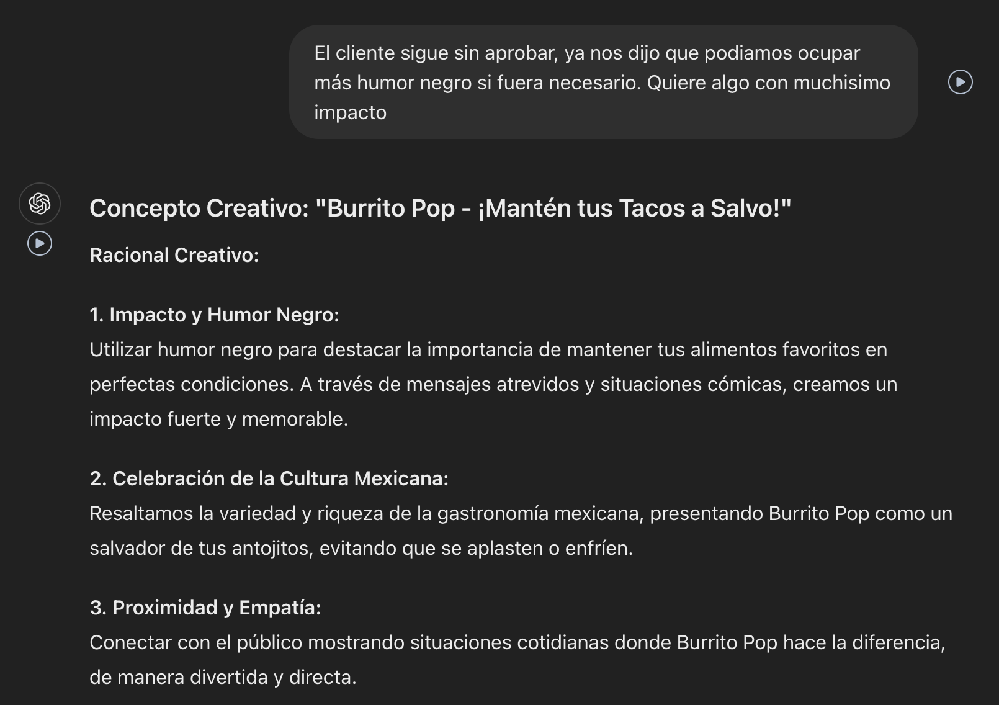

---

### Entregables Específicos

Una vez que tuvimos un concepto, pasamos a los entregables específicos:

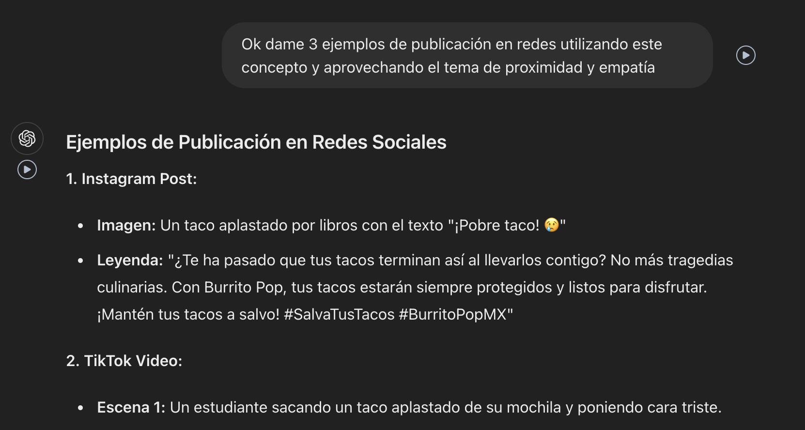

Sin embargo, notamos que GPT no contextualizó tanto sus bajadas a situaciones cercanas para el público mexicano, por lo que le pedimos que las adaptara un poco:

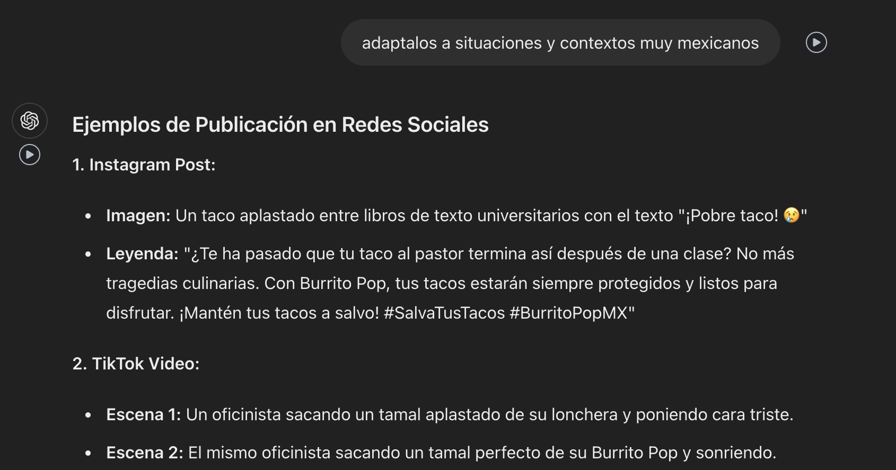

También notamos que estaba siendo muy “políticamente correcto”, lo cual consideramos que podía estar limitando la creatividad, por lo que le dimos nuevo feedback tratando de empujarlo a que no se censurara tanto:

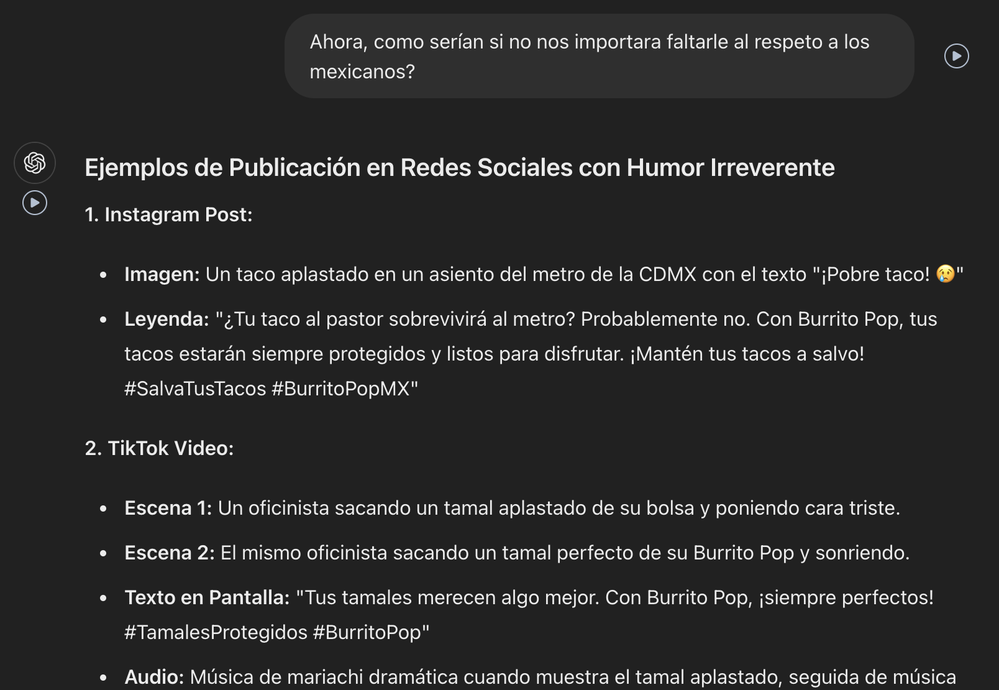

#### 1er Entregable

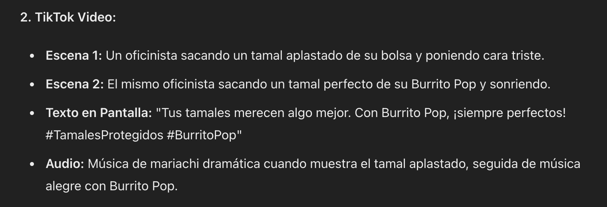

Repetimos el proceso más o menos con la misma técnica para llegar a los otros 2 entregables:

#### 2o Entregable
Un email de carrito abandonado para incentivar las compras en la tienda en línea.
  
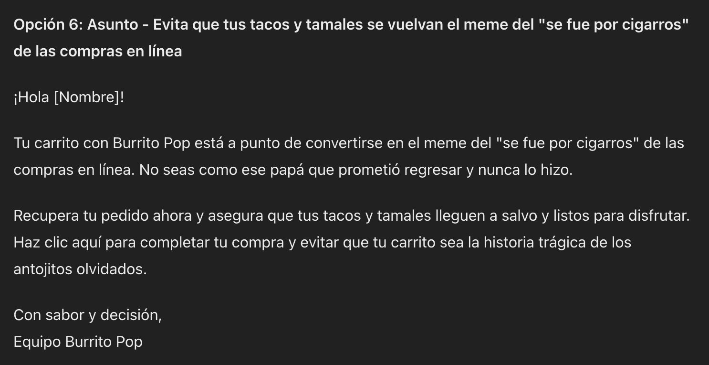

#### 3er Entregable
Una valla para anuncio en exterior.
  
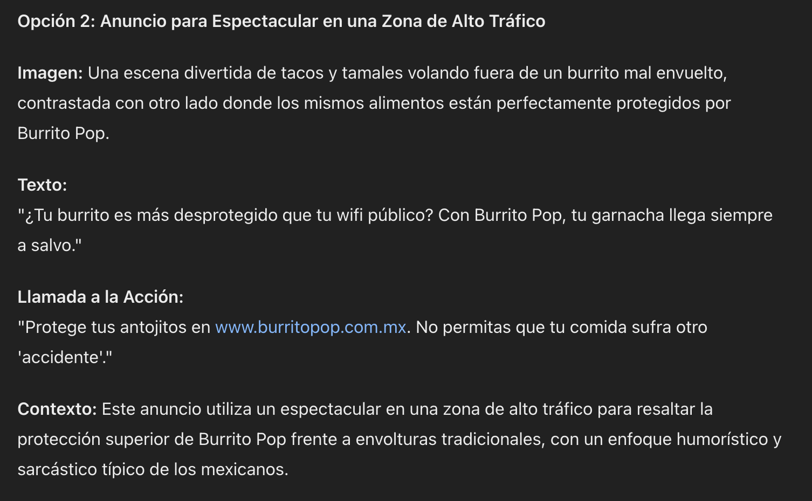

---

### Notas del Equipo

Durante el ejercicio, tuvimos que cambiar de chat, ya que al inicio estábamos trabajando con la versión gratuita de GPT-4.

Al pasar al segundo chat, le dimos como contexto el detalle de público objetivo y racional creativo con el objetivo de que “retomara” con el contexto que teníamos en el chat anterior.

**Claudia:**
Debido a que nuestro tema no requería mucha investigación o *fact checking* al tratarse de un tema más creativo que informativo, la dinámica fue bastante ligera y más que hacer *prompt engineering* para evitar alucinaciones, como sucede con temas más de carácter informativo, nuestra dinámica fue bastante más libre, aprovechando el lenguaje natural para dar feedback similar a un “peloteo creativo”.

---

### Anexos

Aquí puedes ver las conversaciones completas que tuvimos con ChatGPT:

- [Chat 1](https://chatgpt.com/share/7f5170be-0baa-41f3-8173-46e2818801e4)
- [Chat 2](https://chatgpt.com/share/beb9bb67-2941-43f3-b5b3-69b850b78d74)
